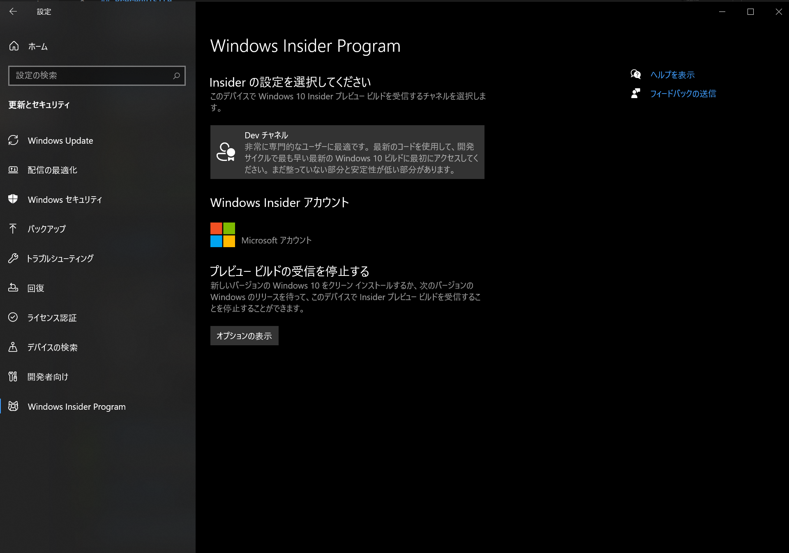
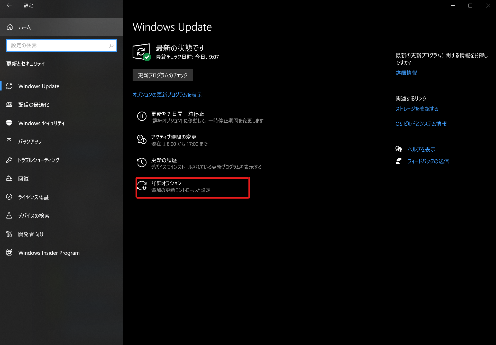
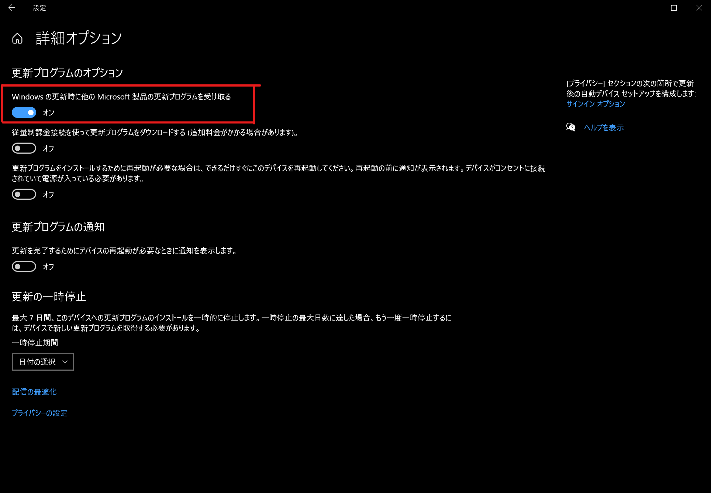
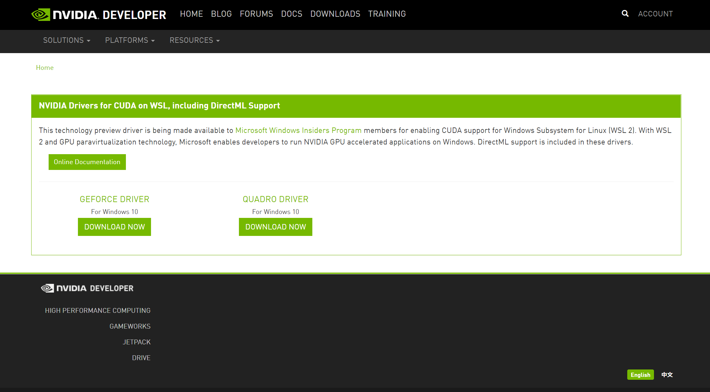
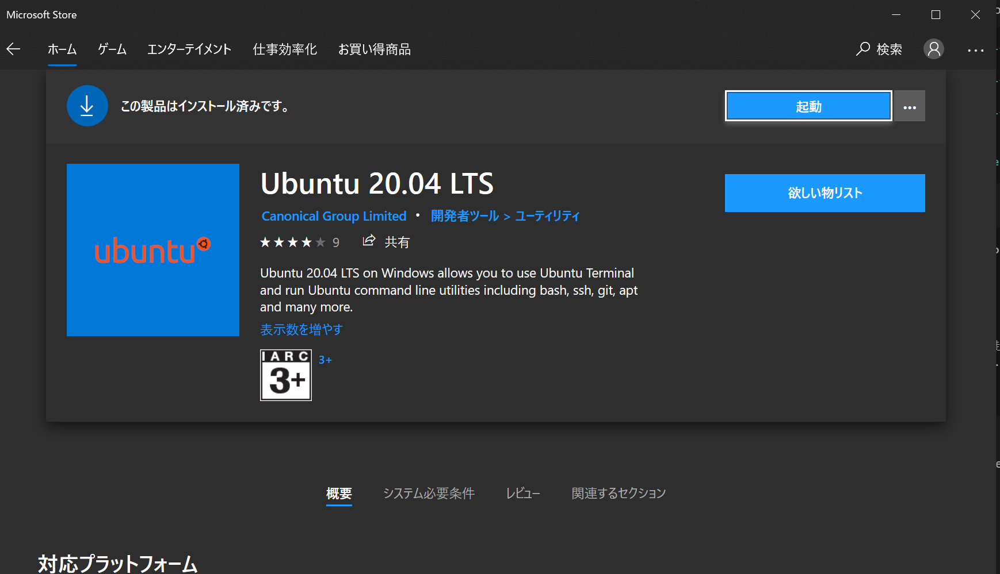

# Steps to build Docker for GPU on Ubuntu on WSL2
## reference
- [WSL command reference](https://docs.microsoft.com/ja-jp/windows/wsl/reference)
- [Windows 10 updater](https://www.microsoft.com/ja-jp/software-download/windows10)
- [Linux kernel update](https://docs.microsoft.com/ja-jp/windows/wsl/wsl2-kernel#download-the-linux-kernel-update-package)
- [Nvidia driver for WSL](https://developer.nvidia.com/cuda/wsl/download)

## Prerequisite
- OS: Windows 10 Pro Insider Preview (OS Build 2015 or later)
- Linux kernel >=4.19.121 (Linux running on WSL)
- Nvidia driver installed for WSL


## Enable Windows features
Run the following command in powershell
```powershell
dism.exe /online /enable-feature /featurename:Microsoft-Hyper-V-All /all /norestart

dism.exe /online /enable-feature /featurename:Microsoft-Windows-Subsystem-Linux /all /norestart

dism.exe /online /enable-feature /featurename:VirtualMachinePlatform /all /norestart

# 拡張機能の状態を確認
dism /online /Get-Features
```

### Windows insider Program (Optional)

Please set the Insider program to the "dev" channel.


## WSL update (Optional)

step 1.

step 2.


### WSL Update
After rebooting, execute the following command.

```
>wsl --set-default-version 2

>wsl --update
更新をチェック中...
更新をダウンロード中...
更新をインストール中...
この変更は、次回の WSL 再起動時に有効になります。強制的に再起動するには、' wsl --shutdown ' を実行してください。
カーネル バージョン: 4.19.128

>wsl --shutdown
```

# Install the Nvidia driver for WSL2
- [Nvidia driver for WSL](https://developer.nvidia.com/cuda/wsl)



## Install Ubuntu



## Execute each script.
Execute in the following order.

1. wsl-install-cudaxx.sh
1. wsl-install-nvidia-container-toolkit.sh
1. wsl-install-docker.sh


## CUDA operation check
Execute the following command and pass the test.
```
cd /usr/local/cuda/samples/4_Finance/BlackScholes
sudo make
./BlackScholes
```
The result is as follows.
```
:/usr/local/cuda/samples/4_Finance/BlackScholes# ./BlackScholes
[./BlackScholes] - Starting...
GPU Device 0: "Turing" with compute capability 7.5

Initializing data...
...allocating CPU memory for options.
...allocating GPU memory for options.
...generating input data in CPU mem.
...copying input data to GPU mem.
Data init done.

Executing Black-Scholes GPU kernel (512 iterations)...
Options count             : 8000000
BlackScholesGPU() time    : 0.273049 msec
Effective memory bandwidth: 292.987901 GB/s
Gigaoptions per second    : 29.298790

BlackScholes, Throughput = 29.2988 GOptions/s, Time = 0.00027 s, Size = 8000000 options, NumDevsUsed = 1, Workgroup = 128

Reading back GPU results...
Checking the results...
...running CPU calculations.

Comparing the results...
L1 norm: 1.741792E-07
Max absolute error: 1.192093E-05

Shutting down...
...releasing GPU memory.
...releasing CPU memory.
Shutdown done.

[BlackScholes] - Test Summary

NOTE: The CUDA Samples are not meant for performance measurements. Results may vary when GPU Boost is enabled.

Test passed
```

# WslRegisterDistribution failed with error: 0x800706be.


supported by updating the kernel of WSL from [here](https://wslstorestorage.blob.core.windows.net/wslblob/wsl_update_x64.msi).

# If the GPU is not recognized on WSL2

Reinstall the [Nvidia driver for WSL2](https://developer.nvidia.com/cuda/wsl/download) in Windows.